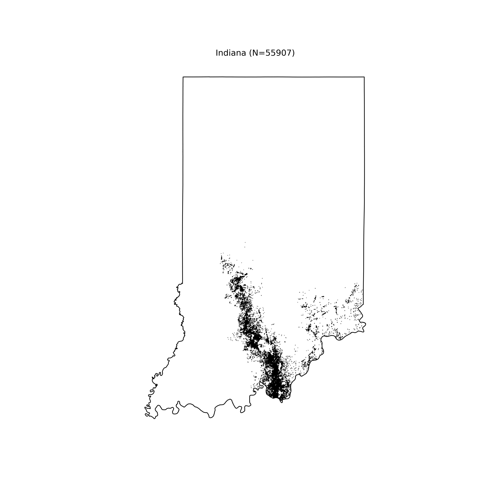
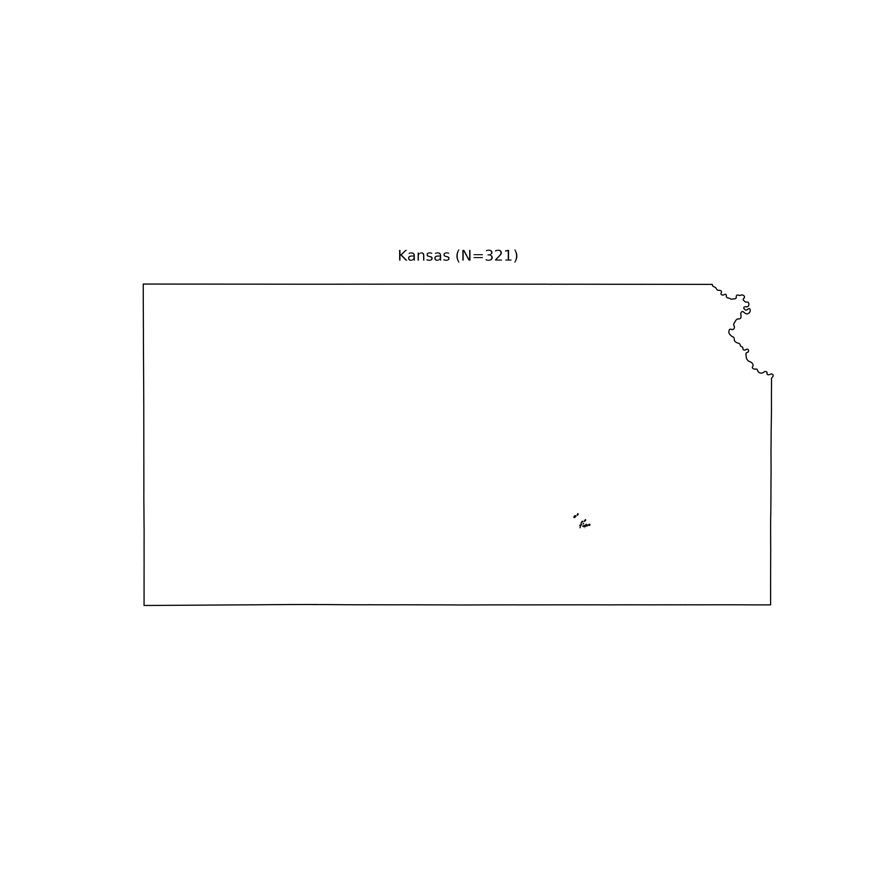
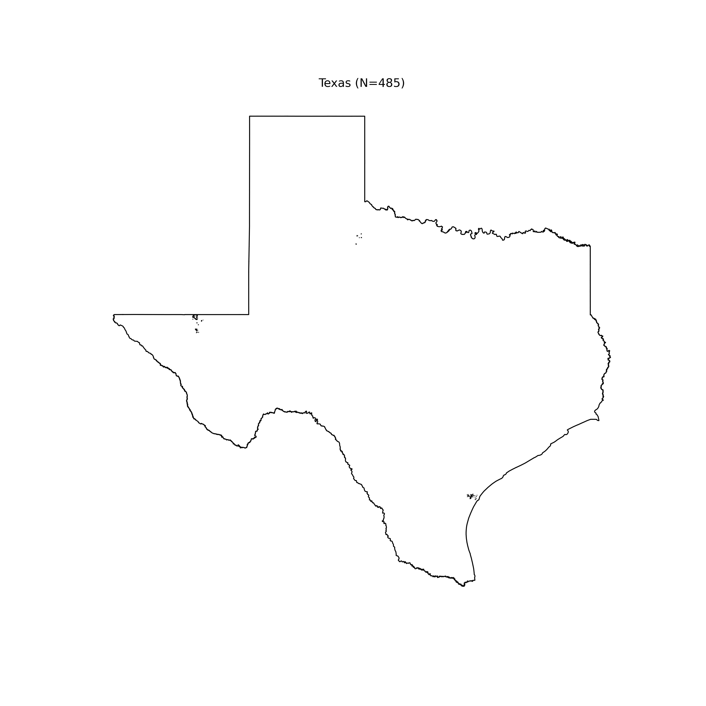

## Contact

[Rok Mihevc](mailto:rok.mihevc@gmail.com)

## Map of Slovenian dolines

Here you can download the [Slovenian dolines dataset](https://github.com/rok/dolines/releases/download/v1.0/dolines-v1.0.zip). It contains the shp format and calculated statistics in csv.
This is meant to accompany [our paper in Acta carsologica](https://ojs.zrc-sazu.si/carsologica/article/view/9462/9371).

### Map preview

### Citing
Mihevc, A., Mihevc, R., 2021. Distribution and morphological characteristics of dolines in Slovenia defined by lidar data sets and machine learning. Acta carsologica

## Maps of US dolines

Here you can download the [US dolines dataset](https://github.com/rok/dolines/releases/download/v2.0/US_dolines.zip). It contains doline polygons in shp format. This is meant to accompany future papers.
We have mapped dolines in the: Alabama, Arizona, Arkansas, Florida, Georgia, Illinois, Indiana, Iowa, Kansas, Kentucky, Maryland, Massachusetts, Minnesota, Missouri, New Mexico, New York, Ohio, Pennsylvania, Puerto Rico, South Carolina, Tennessee, Texas, Virginia, Washington, West Virginia. We believe other states with a possible exception of Alaska do not have dolines.

### Citing

DOI: [https://zenodo.org/record/5856456](https://zenodo.org/record/5856456)

### Map previews

Alabama

Arizona

Arkansas

Florida

Georgia

Illinois

Indiana

Iowa

Kansas

Kentucky

Maryland

Massachusetts

Minnesota

Missouri

New Mexico

New York

Ohio

Pennsylvania

Puerto Rico

South Carolina

Tennessee

Texas

Virginia

Washington

West Virginia

